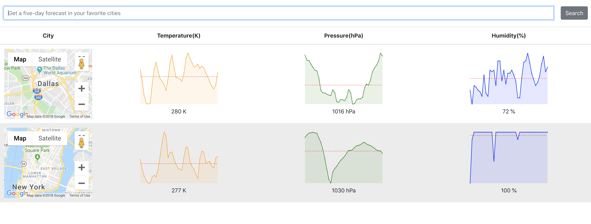

# Weather
This is a weather forecast browser web application building with the React.
## Getting Started
I used the [Create React App](https://github.com/facebook/create-react-app) to initialize this app.
### Prerequisites
Make sure you have the Node.js installed, after you install the Node, NPM will also be included.
### Clone 
```
git clone https://github.com/Crysisun/Weather.git
```
### Run the app
```
cd Weather
npm start
```
* Open the client at http://localhost:3000/
* The web app will show up, you can type in the city name you want, after clicking on search button, you will get the forecast graphs on the specific city of their temperature, humidity and air pressure for the next five days.

## Built with
* [React](https://reactjs.org/)
